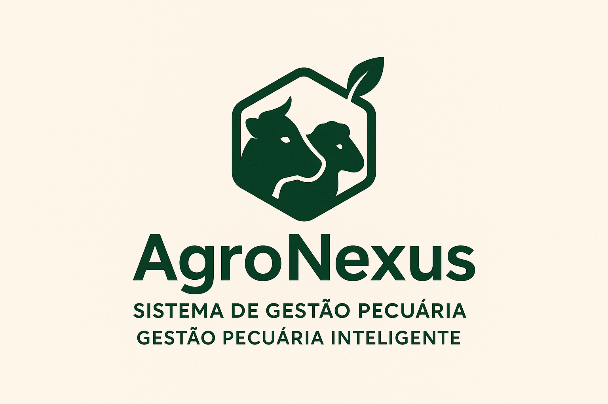

# 🌾 AgroNexus Mobile



**AgroNexus Mobile** é um aplicativo móvel desenvolvido em Flutter para gestão agropecuária, focado no controle e monitoramento de rebanhos, lotes, propriedades rurais e atividades relacionadas ao agronegócio.

## 📱 Sobre o Projeto

O AgroNexus Mobile oferece uma solução completa para produtores rurais gerenciarem suas operações de forma eficiente e moderna. O aplicativo permite o controle detalhado de animais, lotes, propriedades e fornece ferramentas essenciais para tomada de decisões no agronegócio.

### 🎯 Principais Funcionalidades

- **🐄 Gestão de Animais**: Cadastro, edição e monitoramento completo do rebanho
- **📊 Controle de Lotes**: Organização e acompanhamento de grupos de animais
- **🏡 Gerenciamento de Propriedades**: Administração de fazendas e propriedades rurais
- **📋 Dashboard Inteligente**: Visualização de dados e métricas importantes
- **🔔 Sistema de Notificações**: Alertas e lembretes para atividades importantes
- **📍 Geolocalização**: Integração com GPS para localização de propriedades
- **📷 Captura de Imagens**: Registro fotográfico de animais e atividades
- **🌐 Conectividade**: Verificação de conexão com internet
- **👤 Sistema de Autenticação**: Login seguro e controle de acesso

### 🚀 Ações e Destinos

O sistema permite gerenciar diferentes destinos para os animais:
- **Leilão**: Preparação para leilões
- **Venda**: Controle de vendas diretas
- **Abate**: Planejamento para abate
- **Permanência**: Manutenção na propriedade

## 🛠️ Tecnologias Utilizadas

### Framework e Linguagem
- **Flutter** 3.6.0+ - Framework de desenvolvimento mobile
- **Dart** - Linguagem de programação

### Principais Dependências

#### 🏗️ Arquitetura e Estado
- **flutter_bloc** `^9.0.0` - Gerenciamento de estado
- **bloc** `^9.0.0` - Padrão BLoC
- **get_it** `^8.0.3` - Injeção de dependências
- **equatable** `^2.0.7` - Comparação de objetos
- **dartz** `^0.10.1` - Programação funcional

#### 🌐 Rede e APIs
- **dio** `^5.8.0+1` - Cliente HTTP
- **internet_connection_checker_plus** `^2.7.0` - Verificação de conectividade

#### 🧭 Navegação
- **go_router** `^14.8.0` - Roteamento avançado

#### 💾 Persistência
- **shared_preferences** `^2.5.2` - Armazenamento local

#### 🎨 Interface do Usuário
- **google_fonts** `^6.2.1` - Fontes personalizadas
- **font_awesome_flutter** `^10.8.0` - Ícones
- **flutter_expanded_tile** `^0.4.0` - Componentes expansíveis
- **flutter_animate** `^4.1.1+1` - Animações

#### 🔧 Utilitários
- **image_picker** `^1.1.2` - Captura de imagens
- **mask_text_input_formatter** `^2.9.0` - Formatação de texto
- **url_launcher** `^6.3.1` - Abertura de URLs
- **intl** `^0.20.2` - Internacionalização
- **date_field** `^6.0.3+1` - Campos de data
- **geolocator** `^13.0.4` - Geolocalização

## 🏗️ Arquitetura do Projeto

O projeto segue os princípios da **Clean Architecture** e **Domain-Driven Design (DDD)**:

```
lib/
├── config/           # Configurações gerais da aplicação
│   ├── api.dart      # URLs e endpoints da API
│   ├── app.dart      # Configuração principal do app
│   ├── exceptions.dart # Tratamento de exceções
│   ├── inject_dependencies.dart # Injeção de dependências
│   ├── utils.dart    # Utilitários gerais
│   ├── routers/      # Configuração de rotas
│   ├── services/     # Serviços da aplicação
│   └── theme/        # Tema e estilos
├── domain/           # Camada de domínio
│   ├── models/       # Entidades de negócio
│   ├── repositories/ # Interfaces dos repositórios
│   └── services/     # Serviços de domínio
└── presentation/     # Camada de apresentação
    ├── bloc/         # BLoCs para gerenciamento de estado
    ├── cubit/        # Cubits para estados simples
    ├── fazenda/      # Telas de fazenda
    ├── home/         # Tela principal
    ├── login/        # Telas de autenticação
    ├── splash/       # Tela de splash
    └── widgets/      # Componentes reutilizáveis
```

## 🚀 Como Executar o Projeto

### Pré-requisitos

1. **Flutter SDK** 3.6.0 ou superior
2. **Dart SDK** incluído no Flutter
3. **Android Studio** / **VS Code** com plugins do Flutter
4. **Android SDK** para desenvolvimento Android
5. **Xcode** para desenvolvimento iOS (apenas macOS)

### Instalação

1. **Clone o repositório**
   ```bash
   git clone https://github.com/seu-usuario/agronexus-mobile.git
   cd agronexus-mobile
   ```

2. **Instale as dependências**
   ```bash
   flutter pub get
   ```

3. **Configure o ambiente**
   ```bash
   flutter doctor
   ```

4. **Execute o projeto**
   ```bash
   flutter run
   ```

### Configuração da API

⚠️ **Importante**: Configure a URL da API no arquivo `lib/config/api.dart`:

```dart
class API {
  static const String baseUrl = 'https://sua-api-url.com/';
  // ... outras configurações
}
```

### Executando em Diferentes Plataformas

- **Android**: `flutter run -d android`
- **iOS**: `flutter run -d ios`
- **Web**: `flutter run -d web`
- **Desktop**: `flutter run -d windows/macos/linux`

## 📱 Funcionalidades Principais

### 🔐 Autenticação
- Login seguro com email e senha
- Sistema de refresh token
- Logout automático em caso de token expirado

### 🐄 Gestão de Animais
- Cadastro completo com fotos
- Histórico de movimentações
- Controle de peso e medidas
- Rastreabilidade completa

### 📊 Dashboard
- Métricas em tempo real
- Gráficos e relatórios
- Indicadores de performance

### 📱 Recursos Mobile
- Interface responsiva
- Funcionamento offline limitado
- Sincronização automática
- Notificações push

## 🔧 Scripts Disponíveis

### Executar o aplicativo
```bash
flutter run
```

### Executar testes
```bash
flutter test
```

### Gerar build para produção
```bash
# Android
flutter build apk --release
flutter build appbundle --release

# iOS
flutter build ios --release

# Web
flutter build web --release
```

### Análise de código
```bash
flutter analyze
```

### Formatação de código
```bash
dart format .
```

## 📦 Build e Deploy

### Android
1. Configure as chaves de assinatura em `android/key.properties`
2. Execute: `flutter build appbundle --release`
3. Upload para Google Play Console

### iOS
1. Configure certificados no Xcode
2. Execute: `flutter build ios --release`
3. Archive e upload para App Store Connect

## 🤝 Contribuição

1. **Fork** o projeto
2. Crie uma **branch** para sua feature (`git checkout -b feature/nova-feature`)
3. **Commit** suas mudanças (`git commit -m 'Adiciona nova feature'`)
4. **Push** para a branch (`git push origin feature/nova-feature`)
5. Abra um **Pull Request**

### 📝 Padrões de Código

- Siga as convenções do **Dart/Flutter**
- Use **BLoC** para gerenciamento de estado
- Mantenha a **Clean Architecture**
- Escreva **testes** para novas funcionalidades
- Documente **APIs** e funções complexas

## 📋 Requisitos de Sistema

### Mínimos
- **Android**: API 21 (Android 5.0)
- **iOS**: iOS 12.0
- **RAM**: 2GB
- **Armazenamento**: 100MB

### Recomendados
- **Android**: API 30+ (Android 11+)
- **iOS**: iOS 15.0+
- **RAM**: 4GB
- **Armazenamento**: 500MB

## 🐛 Problemas Conhecidos

- ⚠️ Configuração de HTTPS em desenvolvimento pode requerer certificados específicos
- 📱 Permissões de localização devem ser configuradas manualmente no primeiro uso
- 🌐 Algumas funcionalidades requerem conexão com internet

## 📞 Suporte

Para suporte técnico ou dúvidas:

- 📧 **Email**: suporte@agronexus.com.br
- 📱 **WhatsApp**: (11) 99999-9999
- 🌐 **Site**: https://agronexus.com.br
- 📋 **Issues**: https://github.com/seu-usuario/agronexus-mobile/issues

## 📄 Licença

Este projeto está licenciado sob a licença **MIT** - veja o arquivo [LICENSE](LICENSE) para detalhes.

## 🙏 Agradecimentos

- Equipe de desenvolvimento Flutter
- Comunidade open source
- Produtores rurais que inspiraram este projeto
- Todos os colaboradores e testadores

---

**Desenvolvido com ❤️ para o agronegócio brasileiro** 🇧🇷


